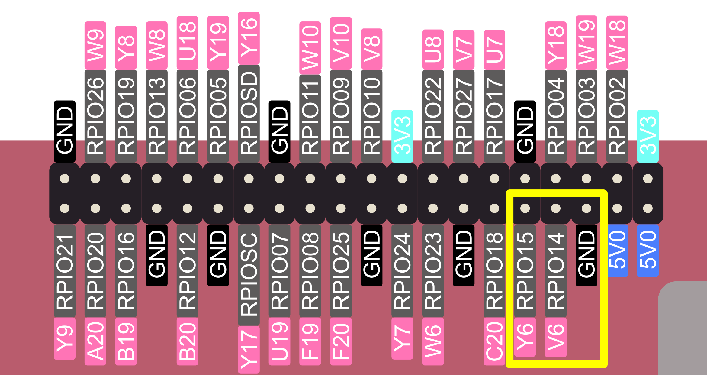
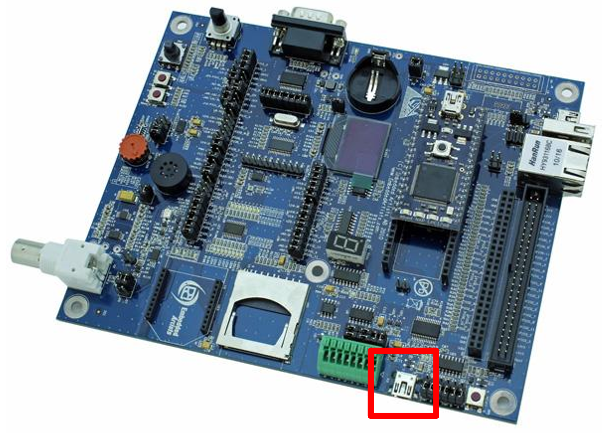
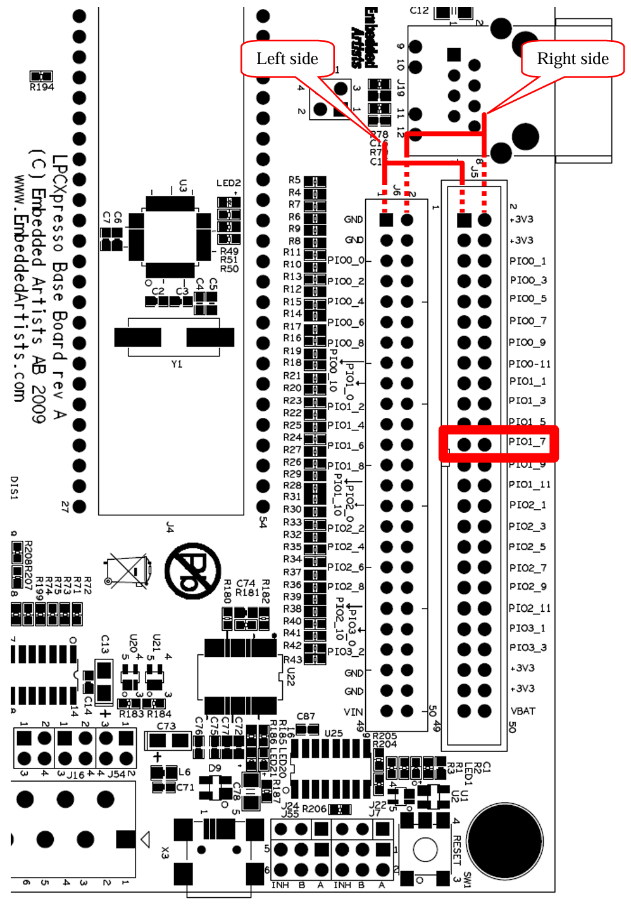

# FRISC-V on the PYNQ-Z2

Reference SoC for the TUL PYNQ-Z2. FRISC-V runs in the programmable logic at 25 MHz and uses the Zynq PS DDR through `S_AXI_HP0`. Its peripherals are AXI slaves in the block design. The Zynq ARM core is only used to load programs and to control the FRISC-V reset.

The flow is driven by `fpga.py` and runs on both Linux and Windows.

## Layout

| Path | Contents |
| --- | --- |
| `fpga.py` | Build and board flow (automate Xilinx without `make` on Windows) |
| `src/` | SoC RTL |
| `bd/design1.tcl` | Block design, exported from Vivado |
| `constraints/` | Pin constraints |
| `scripts/` | Vivado, XSCT and XSDB Tcl scripts called by `fpga.py`, ZSBL ROM generator, Xmodem loader |
| `sw/` | Zero-stage bootloader source and linker |
| `../sim/tb_integration.sv` | AXI-level testbench for the CPU subsystem |

## Prerequisites

- **Vivado 2025.2**. **Vitis 2025.2** is needed only for `boot-bin` and `flash`.
- **Python 3.10+**. `pip install pyserial` if you use the serial terminal or the Xmodem loader.
- **[bender](https://github.com/pulp-platform/bender)** on `PATH`.
- A `riscv64-unknown-elf` toolchain to build programs.

Python, Bender, and a RISC-V toolchain are included in Nix, only Vivado and Vitis need separate system installations.

## Quick start

For a step-by-step walkthrough, see [docs/QUICKSTART.md](docs/QUICKSTART.md).

Run from this directory (`python` instead of `python3` on Windows):

```bash
python3 fpga.py bitstream
python3 fpga.py go --bin prog.bin -t  # program the FPGA, load prog.bin, release reset, open a terminal
```

Programs must be linked at `0x8000_0000` (the start of DRAM).

| Command | Does |
| --- | --- |
| `project` | Create the Vivado project in `build/vivado/` |
| `open` | Open the project in the Vivado GUI |
| `bitstream [-j N] [--no-boot-bin]` | Synthesize and implement. Writes `friscv.bit`, `.hwh`, `.xsa`, `ps7_init.tcl`, timing and utilization reports to `build/out/`, then generates `BOOT.bin` if Vitis is available |
| `boot-bin` | Build the FSBL from the XSA and generate `BOOT.bin` |
| `program` | Program the FPGA over JTAG |
| `load --bin FILE` | Hold FRISC-V in reset and write `FILE` to DRAM through XSDB |
| `run` | Pulse the FRISC-V reset |
| `go [--bin FILE] [-t] [-p PORT]` | `program`, optionally `load`, then `run`. `-t` opens a serial terminal |
| `status` | Print the first words of DRAM |
| `flash` | Write `BOOT.bin` to QSPI flash |
| `export-bd` | Write the block design back to `bd/design1.tcl` |
| `zsbl-rom` | Regenerate `src/friscv_zsbl_rom.sv` from `sw/zsbl.S` |
| `clean` | Delete `build/` |

## Configuration

The core configuration is set by the parameter defaults of `src/friscv_axi_wrap.v`. They are also editable in the block design GUI.

| Parameter | Default | |
| --- | --- | --- |
| `ZSBL_BASE`, `ZSBL_SIZE_BYTES` | `0x1000`, `1024` | Boot ROM window and reset vector. A size of `0` removes the ROM and resets into DRAM |
| `ENABLE_MMU`, `ENFORCE_PMP` | `1`, `1` | |
| `PMP_ENTRIES`, `PMP_USABLE` | `16`, `5` | |
| `ITLB_ENTRIES`, `DTLB_ENTRIES`, `ENABLE_FINE_TLB_FLUSH` | `4`, `8`, `1` | |
| `ENABLE_U_MODE`, `ENABLE_S_MODE` | `1`, `1` | |
| `ENABLE_ISA_M`, `ENABLE_FAST_MUL`, `ENABLE_ISA_A` | `1`, `1`, `1` | |
| `HALT_ON_END_ADDRESS` | `1` | A store to `0x5000_0000` halts the core until reset |

## Address map

FRISC-V addresses are remapped to AXI addresses by `src/friscv_remap.sv`.

| FRISC-V address | AXI address | Device |
| --- | --- | --- |
| `0x0000_1000` | not on AXI | ZSBL ROM (1 KiB, read-only) |
| `0x0200_0000` | `0x4010_0000` | CLINT |
| `0x1000_0000` | `0x4060_0000` | UART 16550 |
| `0x4000_0000` | `0x4000_0000` | GPIO 0: LEDs (channel 1), switches `SW0`–`SW1` (channel 2, offset `0x8`) |
| `0x4001_0000` | `0x4001_0000` | GPIO 1: buttons |
| `0x4002_0000` | `0x4002_0000` | GPIO 2: RGB LED on the I/O board |
| `0x8000_0000` | `0x0010_0000` | PS DDR |

The PS controls the FRISC-V reset through `gpio_aresetn` at `0x4120_0000`, where bit 0 = 1 means running.

## Boot

More details in [docs/BOOT.md](docs/BOOT.md).

After reset FRISC-V runs the zero-stage bootloader (`sw/zsbl.S`) from the on-chip ROM. The ZSBL prints `[ZSBL] Ready` on the UART and reads the boot mode from `SW1:SW0`. Set the mode before releasing reset.

| `SW1` `SW0` | Mode | Behaviour |
| --- | --- | --- |
| 0 0 | DRAM | Jump to `0x8000_0000`. Use with `fpga.py load` or `go --bin` |
| 0 1 | UART | Receive a program over Xmodem-CRC into DRAM, then jump to it |
| 1 0 | SD | Not implemented, falls through to mode 3 |
| 1 1 | Wait | Wait for `BTN0`, then jump to `0x8000_0000` |


The ZSBL passes the hart ID in `a0` and `0x8020_0000` (device tree) in `a1`.

For UART boot, send the program with `python3 scripts/xmodem_load.py --port /dev/ttyUSB0 --bin prog.bin` (`--port COM3` on Windows), or with the Xmodem send of any terminal (for example minicom). The ZSBL retries for about a minute before it gives up on mode 1.

To change the bootloader, edit `sw/zsbl.S` and run `python3 fpga.py zsbl-rom`. If you move the ROM, keep `sw/zsbl.ld` in sync with `ZSBL_BASE`.

## UART

Register map, host connection and C examples are in [docs/UART.md](docs/UART.md).

UART TX and RX are on the Raspberry Pi header, pins 8 (`RPIO14`, `V6`) and 10 (`RPIO15`, `Y6`), with ground on pin 6. The UART runs at 115200 8N1. The ZSBL programs divisor 14 for the 25 MHz clock.



With the Embedded Artists LPCXpresso base board (I/O board), connect PYNQ `RXD0` to `PIO1.6` and `TXD0` to `PIO1.7`, and use the board's USB-to-UART bridge (`X3`). Also connect the grounds if you don't use the connection board.




On Windows the bridge shows up as a COM port: `python fpga.py go -t -p COM3`, or `python -m serial.tools.miniterm COM3 115200`.

## QSPI flash boot

`BOOT.bin` holds the FSBL and the bitstream. With `BOOT.bin` in flash, the board configures itself on power-on without JTAG.

1. Set jumper **JP4** to **JTAG** and power the board.
2. Run `python3 fpga.py flash`.
3. Set **JP4** back to **QSPI** and power-cycle the board.

The ZSBL boot mode still comes from the switches.

## Simulation

The Vivado project's `sim_1` runs `tb_integration`. It uses the same `friscv_axi_wrap` top as the block design, with an AXI memory, UART and GPIO model and the CLINT. The testbench boots through the ZSBL in DRAM mode, loads the program given with `+PROG_FILE=<file.bin>` (default `prog.bin`), and reports `[RESULT] PASS` when the program writes `0xAABBCCDD` to GPIO 0. Pass the plusarg in the project's simulation settings under `xsim.simulate.xsim.more_options`, for example `-testplusarg PROG_FILE=/path/to/test.bin`.

## Editing the block design

Open the project with `python3 fpga.py open`, edit `design_1`, save it, then run `python3 fpga.py export-bd` and commit `bd/design1.tcl`. Changes inside `build/` are lost the next time the project is created.
