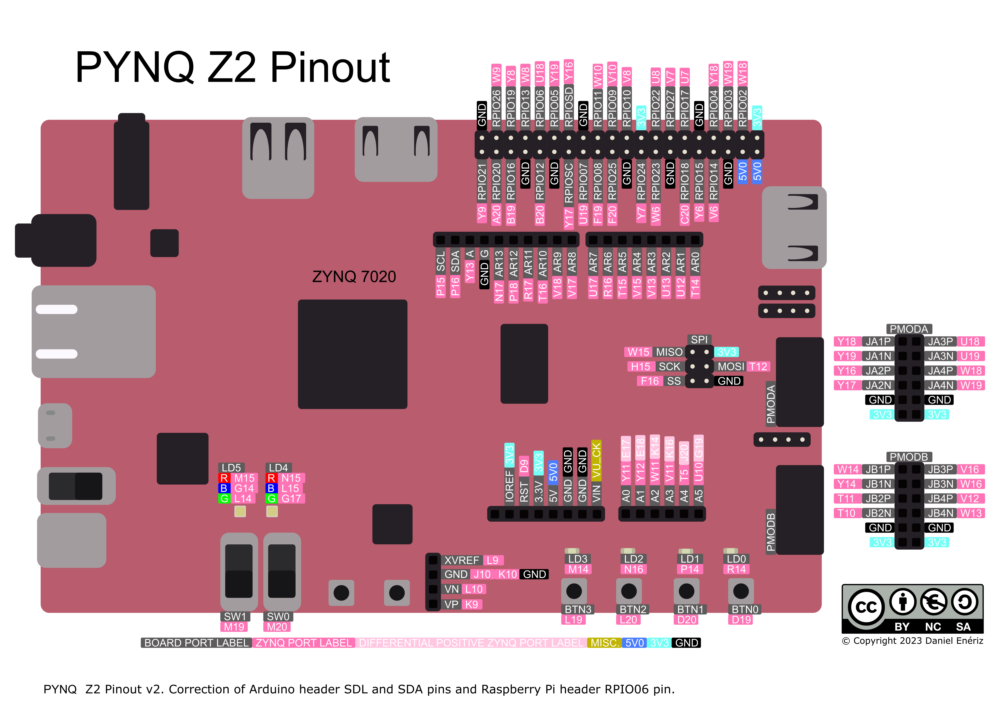

# Booting on FRISC-V

FRISC-V has the ability to load programs by itself using the zero-stage bootloader (ZSBL) stored in an on-chip ROM. Four boot modes are supported:

Mode   | Method          | Description
------ | --------------- | -----------
Mode 0 | Direct Jump     | Program loaded externally (via XSDB), just jump to program in memory.
Mode 1 | Xmodem          | Load program from a host machine via UART
Mode 2 | -               | -
Mode 3 | Wait for `BTN0` | Wait for press of `BTN0`, then jump to externally loaded program.

## Selecting Boot Mode

The boot mode is selected by toggling the switches on the bottom edge of the PYNQ-Z2 (`SW0` and `SW1`). The mode must be selected before startup or reset.



The boot mode is encoded in binary by the switch positions, as shown in the table

Mode   | Encoding | `SW1` position | `SW0` position
------ | -------- | -------------- | --------------
Mode 0 | `00`     | `0` - Down     | `0` - Down
Mode 1 | `01`     | `0` - Down     | `1` - Up
Mode 2 | `10`     | `1` - Up       | `0` - Down
Mode 3 | `11`     | `1` - Up       | `1` - Up

## Boot Process

The zero-stage bootloader is the first program executed after a reset. Its purpose is loading the application program (often an embedded application or a bootloader of an OS) into main memory.

On successful startup, `[ZSBL] Ready` is printed to UART. Immediately after, the boot mode is read from the switches. The detected boot mode will be printed to UART without attempting a load/boot. The messages corresponding to each of the modes are shown in the table below:

Mode   | Message
------ | -------
Mode 0 | `[ZSBL] Mode: DRAM`
Mode 1 | `[ZSBL] Mode: UART`
Mode 2 | `[ZSBL] Mode: SD`
Mode 3 | `[ZSBL] Waiting for BTN0 press`

### Mode 0 - Direct Jump

This is the simplest boot mode. A program needs to be loaded into main memory using XSDB while FRISC-V is in reset (`LD5` showing red), then reset needs to be released with Mode 0 selected. The program must be loaded to the start of DRAM, at AXI address `0x0010_0000`, which corresponds to FRISC-V address `0x8000_0000`.

Start with a programmed board in reset, then execute the following commands.

```bash
python3 fpga.py load --bin prog.bin
python3 fpga.py run
```

The `load` command writes `prog.bin` to address `0x8000_0000`. In Mode 0, execution starts immediately after the release of reset, without waiting for user input.

### Mode 1 - Xmodem

Mode 1 uses the standard Xmodem protocol to copy a file from the host machine into main memory. This is the preferred method as it is the fastest, and does not rely on the Xilinx tools (XSDB). Instead, standard Linux programs like `minicom` or `sx` can be used. A Python script (`scripts/xmodem_load.py`) is also provided, and it works on both Linux and Windows.

Start with a serial connection to the UART chip of the I/O board (see [UART.md](UART.md)) and a programmed board. On Linux, confirm `/dev/ttyUSB0` is present. On Windows, find the COM port in Device Manager.

Select Mode 1 and start/reset FRISC-V. When `LD0` lights up green, the ZSBL is waiting for the host to start an Xmodem transfer. FRISC-V will retry 16 times over the course of about a minute. If a transfer was not started during that time, Mode 1 will be aborted and Mode 2 started. That will be indicated by the turning off of `LD0`.

Once `LD0` turns green, an Xmodem transfer should be started.

**Minicom:**

`minicom` needs to be installed. Install it by running `sudo apt install minicom -y`. `minicom` must be set to the correct serial port and baudrate, see [UART.md](UART.md).

Open minicom (run `minicom`), enter send mode (`CTRL+A S`) and select `xmodem`. Select the desired binary and confirm.

**Python:**

`pyserial` needs to be installed. Install it by running `pip install pyserial`.

Run the Python script.

```bash
python3 scripts/xmodem_load.py --bin prog.bin
```

By default, the file is sent to `/dev/ttyUSB0` at `115200` baud. Default behavior can be changed using the following command line arguments:

Argument     | Alias | Default        | Example                                              | Description
------------ | ----- | -------------- | ---------------------------------------------------- | -----------
`--bin`      | N/A   | N/A            | `python3 scripts/xmodem_load.py --bin ./app.bin`     | File to send
`--port`     | `-p`  | `/dev/ttyUSB0` | `python3 scripts/xmodem_load.py --port COM3`         | Change which serial port is used
`--baud`     | `-b`  | `115200`       | `python3 scripts/xmodem_load.py -b 9600`             | Change baudrate
`--terminal` | `-t`  | `False`        | `python3 scripts/xmodem_load.py --bin app.bin -t`    | Open a serial terminal after the transfer
`--quiet`    | `-q`  | `False`        | `python3 scripts/xmodem_load.py --quiet`             | Suppress progress output

Execution of the loaded program will start immediately after the Xmodem transfer completes, without user interaction.

### Mode 2 - SD Card

Load a program stored on an SD card inserted into the I/O board. Falls through to Mode 3.

> [!WARNING]
> Mode 2 is not implemented yet.

### Mode 3 - Wait for Button Press

Similar to Mode 0, expects a program to be externally loaded into main memory. Execution does not start immediately after release of reset, but after the user presses `BTN0`. There is no timeout for this boot mode.

## QSPI Flash Boot

The PYNQ-Z2 can boot entirely from QSPI flash, with no JTAG connection required. A `BOOT.bin` image containing the Zynq First Stage Boot Loader (FSBL) and the FPGA bitstream is written to the flash once. On every subsequent power-on the board programs itself and starts FRISC-V automatically.

### Prerequisites

Vitis 2025.2 is needed in addition to Vivado. `fpga.py` must be able to find `xsct`, `bootgen` and `program_flash`, either on `PATH` or through `$XILINX_VITIS` (set by sourcing Vitis's `settings64.sh` or `settings64.bat`).

### Generating BOOT.bin

`BOOT.bin` is generated automatically during the bitstream build:

```bash
python3 fpga.py bitstream
```

The output files are `build/out/BOOT.bin` and `build/out/fsbl.elf`. If Vitis is missing, the bitstream build still succeeds but skips `BOOT.bin` generation with a warning. Run `python3 fpga.py boot-bin` later to generate it.

### Flashing

1. Set the boot mode jumper **JP4** to **JTAG**.
1. Connect the board via USB and power it on.
1. Run `python3 fpga.py flash`.
1. After flashing completes, set **JP4** back to **QSPI** and power-cycle the board.

The board will now self-program on every power-on. The ZSBL boot mode (DRAM, UART, etc.) is still selected by the switches as described above.
